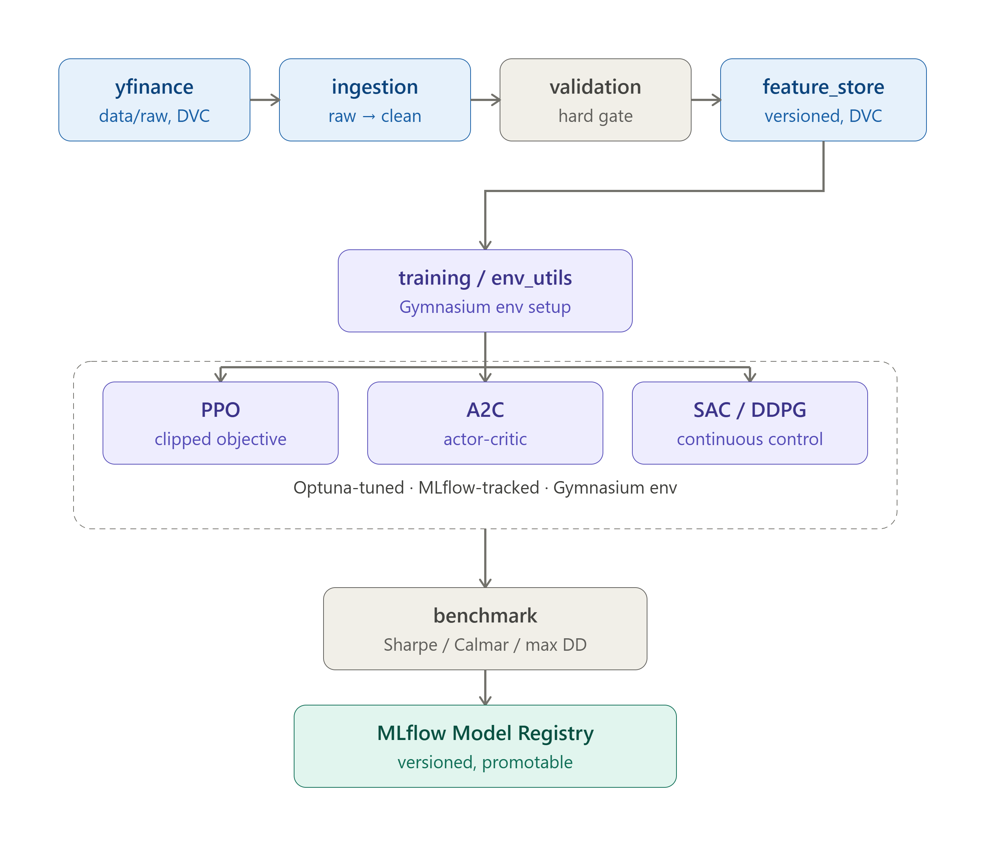
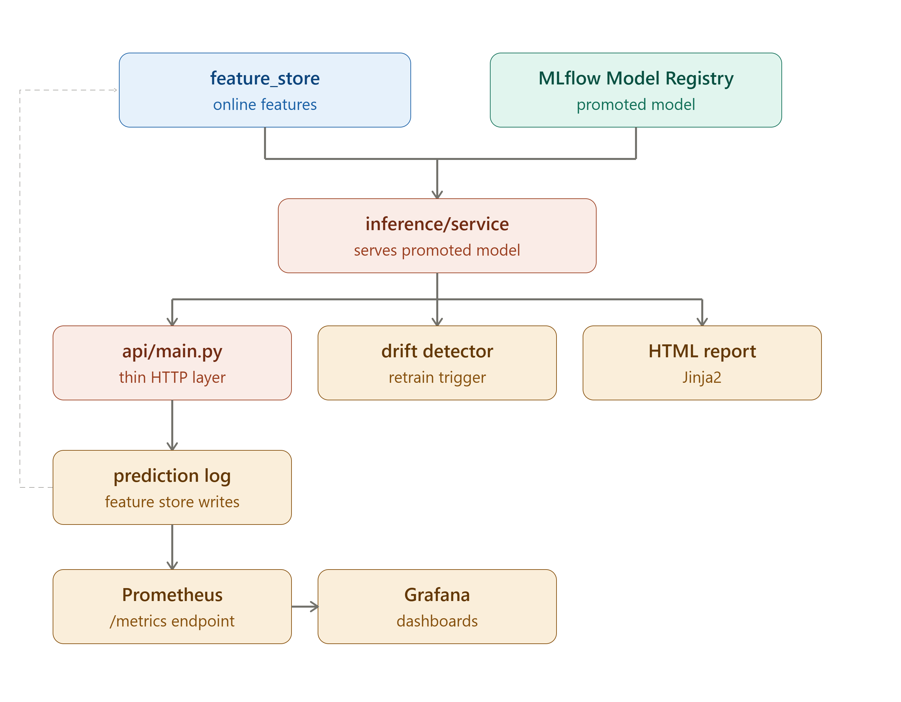

# AutoPortfolio

A production-grade MLOps platform for deep reinforcement learning portfolio management.
**This is not a trading bot.** It does not place orders or talk to a broker — it researches,
trains, benchmarks, registers, monitors, and serves portfolio *allocation recommendations*
that a human or downstream system can act on.

## What it does

Given a universe of tickers (e.g. NIFTY banking stocks), AutoPortfolio trains four RL agents
(PPO, A2C, SAC, DDPG) to allocate capital across that universe day by day, picks the best one
by risk-adjusted return, registers it as a versioned model, serves recommendations over an API,
and watches the live model for performance drift — re-triggering training automatically when it
degrades.

## Architecture

**Training pipeline** — data ingestion through to a registered, versioned model:



**Serving & monitoring pipeline** — how the promoted model gets served, watched for drift, and observed:



`feature_store/` is the single read path both training and inference use — neither reaches
into raw ingestion/computation directly, so they can't silently diverge on what feature set a
model was trained vs served against. `inference/service.py` depends only on the model registry
and the feature store (never on training/scheduler code), and logs every prediction back into
the feature store rather than a private API directory.

The nightly scheduler (`scheduler/pipeline.py`) runs this whole loop end-to-end per portfolio:
ingest → validate (hard gate) → compute & version features → drift check → retrain-if-needed →
benchmark → promote → report. Dataset snapshots are versioned with DVC (see
[`docs/data_versioning.md`](docs/data_versioning.md)) as a deliberate manual/CI step, not an
automatic part of the nightly job.

## Project layout

```
autoportfolio/
├── data/            ingestion, validation, feature computation (engine only)
├── feature_store/   versioned feature storage — the read path for training & inference
├── envs/            Gymnasium portfolio allocation environment
├── agents/          PPO / A2C / SAC / DDPG wrappers (stable-baselines3)
├── training/        trainer, Optuna hyperopt, benchmarking
├── inference/       online inference service (recommendation/status/history logic)
├── registry/        MLflow Model Registry wrapper
├── drift/           rolling live-Sharpe drift detection
├── scheduler/        nightly pipeline orchestration
├── api/             FastAPI serving layer (thin wrapper over inference/)
├── frontend/        Next.js interactive dashboard (overview, recommendations, history, pipeline trigger)
├── reports/         Jinja2 HTML evaluation reports
├── monitoring/      Prometheus metrics + Grafana provisioning
├── config/          portfolio definitions (config/portfolios.yaml)
├── docs/            data_versioning.md (DVC workflow)
├── tests/           pytest suite
├── docker-compose.yml   MLflow, Postgres, API, Prometheus, Grafana
└── run_pipeline.py  CLI entrypoint
```

## Portfolios

Defined in [`config/portfolios.yaml`](config/portfolios.yaml). All tickers are NSE (`.NS`)
symbols, sourced from yfinance (no API key required):

| Portfolio | Tickers | Risk appetite |
|---|---|---|
| `nifty50` | top 20 NIFTY 50 names | moderate |
| `banking` | HDFCBANK, ICICIBANK, KOTAKBANK, AXISBANK, SBIN | moderate |
| `it` | TCS, INFY, WIPRO, HCLTECH, TECHM | aggressive |
| `energy` | RELIANCE, ONGC, NTPC, POWERGRID, BPCL | conservative |

## Setup

### 1. Install dependencies (local dev)

```bash
python -m venv .venv
source .venv/bin/activate  # or .venv\Scripts\activate on Windows
pip install -r requirements.txt
```

### 2. Start infrastructure

```bash
docker compose up -d postgres mlflow prometheus grafana
```

This brings up MLflow (`localhost:5000`), Prometheus (`localhost:9090`), and Grafana
(`localhost:3000`, credentials in `.env`). Postgres backs the MLflow tracking store; artifacts
live in a local Docker volume — no cloud account needed.

### 3. Run the pipeline for one portfolio

```bash
python run_pipeline.py --portfolio banking
```

Or every portfolio:

```bash
python run_pipeline.py --all --parallel
```

This ingests data, validates it, builds features, checks for drift, trains all four agents
(with Optuna hyperparameter search), benchmarks them, promotes the winner, and writes an HTML
report to `reports/`.

### 4. Serve recommendations

```bash
docker compose up -d api
# or locally:
uvicorn api.main:app --reload --port 8000
```

```bash
curl -X POST localhost:8000/portfolio/recommendation \
  -H "Content-Type: application/json" \
  -d '{
    "portfolio_id": "banking",
    "current_holdings": {"HDFCBANK.NS": 0.3, "ICICIBANK.NS": 0.2, "KOTAKBANK.NS": 0.2, "AXISBANK.NS": 0.15, "SBIN.NS": 0.15},
    "risk_appetite": "moderate",
    "capital": 500000,
    "sector_constraints": []
  }'
```

Other endpoints: `GET /portfolio/{id}/status`, `GET /portfolio/{id}/history`,
`POST /pipeline/run`, `GET /health`, `GET /metrics` (Prometheus exposition).

## Dashboard

`frontend/` is an interactive Next.js dashboard over the API — portfolio overview cards with
live status, an interactive recommendation form with charted results, allocation history, and a
button to trigger retraining, all without touching curl or Swagger.

```bash
# with the API running and CORS_ALLOW_ORIGINS=http://localhost:3001 set
cd frontend
npm install
npm run dev   # http://localhost:3001
```

## Data versioning

`data/raw/` and `data/feature_store/` are versioned with [DVC](https://dvc.org) (local remote
by default). See [`docs/data_versioning.md`](docs/data_versioning.md) for the snapshot/restore
workflow.

## Tests

```bash
pytest tests/ -v
```

## Secrets

Local-only credentials for Postgres/Grafana live in `.env` (gitignored). See `.env.example`
for the template. No external API keys are required — yfinance is used for all market data.
